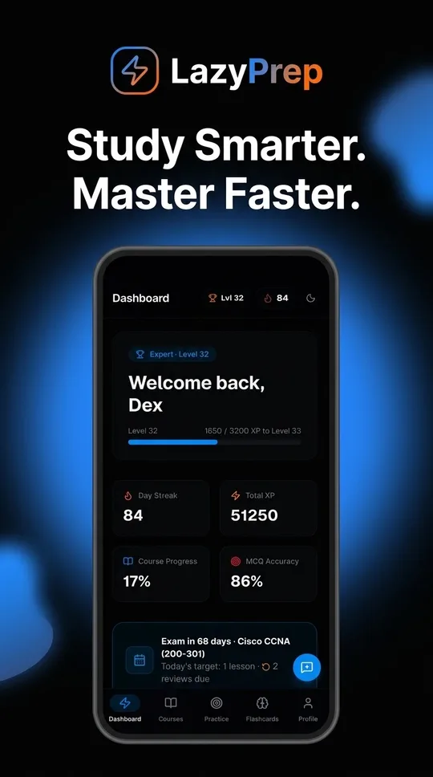
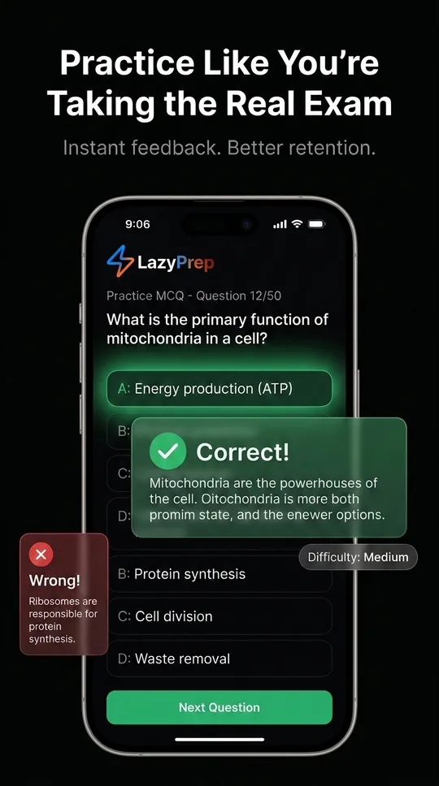

# LazyPrep

### The Preparation OS

**Stop collecting study material. Start retaining it.**

LazyPrep turns certification prep into a system — structured courses, spaced
repetition, and mock exams that adapt to what you keep forgetting.

**[Try it live](https://lazyprep.iamdex.codes)** · Android app coming to Google Play

A product by **[DexForge](https://dexforge.iamdex.codes)**

 

 

---

## The problem

Most people preparing for a certification do the same thing: hoard PDFs, watch
video courses at 2×, and highlight a textbook until it glows. Then they sit the
exam and discover that recognizing an answer is not the same as recalling it.

The bottleneck was never access to material. It's **retention over time**, and
knowing which topics are quietly decaying while you feel productive elsewhere.

LazyPrep is built around that single problem.

## How it works

**Structured courses, not a content dump.** Modules, lessons, and checkpoint
quizzes in a deliberate order, so there's always an obvious next action instead
of a syllabus to triage.

**Spaced repetition that schedules itself.** Flashcards and practice questions
run on the [SM-2 algorithm](https://en.wikipedia.org/wiki/SuperMemo) — the same
family Anki uses. Cards you find easy drift weeks out; cards you fumble come
back tomorrow. You never decide what to review.

**Mock exams with a mistake notebook.** Full timed attempts, scored and
reviewable. Every question you miss is collected into a notebook and folded back
into your review queue, so weak areas get more airtime automatically.

**Progress that reflects reality.** XP, levels, and streaks track *reviews
completed*, not hours logged. An exam countdown converts a distant date into a
concrete daily target.

**Bring your own AI.** Generate a custom course for any subject using your own
AI provider key. Your key is encrypted with AES-256-GCM before it touches the
database and is never returned to any client after saving.

**Installable, and offline-tolerant.** A PWA on desktop and iOS, and a native
Android app via Trusted Web Activity — full-screen, no browser chrome.

## See it

<table>
<tr>
<td width="25%" align="center">
 
<b>One dashboard</b> 
Streaks, XP, and today's target
</td>
<td width="25%" align="center">
 
<b>Exam-style practice</b> 
Instant feedback, mistakes tracked
</td>
<td width="25%" align="center">
 
<b>Smart flashcards</b> 
SM-2 scheduling, no manual review
</td>
<td width="25%" align="center">
 
<b>AI course builder</b> 
Any subject, your own API key
</td>
</tr>
</table>

 
Running on Android — a Trusted Web Activity around the live PWA, no browser chrome

## Built with

| Layer | Choice |
| --- | --- |
| Framework | Next.js 16 (App Router, RSC, Server Actions) |
| Language | TypeScript 5 |
| UI | React 19, Tailwind CSS 4, Base UI, Framer Motion |
| Database | PostgreSQL (Neon) via Prisma 7 |
| Auth | Better Auth — email/password + Google OAuth |
| Email | Resend |
| Monitoring | Sentry |
| Validation | Zod 4 |
| Android | Bubblewrap TWA, `targetSdk` 36 |

## Licensing

This repository is **split-licensed**:

| What | License |
| --- | --- |
| Application code | [MIT](LICENSE) |
| Course content in `content/` | [CC BY-NC-ND 4.0](content/LICENSE) — read and learn, no commercial use, no redistributing modified versions |
| "LazyPrep", "DexForge", logos | Trademarks — not licensed |

LazyPrep is a DexForge product, hosted and operated at
[lazyprep.iamdex.codes](https://lazyprep.iamdex.codes). The source is public
for transparency; the course content under `content/` — the 51 lessons and
flashcard decks that are the bulk of the work here — stays under DexForge
copyright and the CC BY-NC-ND terms above.

## Contributing

Issues and pull requests are welcome — see
[CONTRIBUTING.md](CONTRIBUTING.md). Security issues should follow
[SECURITY.md](SECURITY.md) rather than a public issue.

## Legal

[Privacy Policy](https://lazyprep.iamdex.codes/privacy) ·
[Terms & Conditions](https://lazyprep.iamdex.codes/terms)

Certification and exam names referenced in the course content (including Cisco
CCNA) are trademarks of their respective owners. LazyPrep is an independent
study aid and is not affiliated with, endorsed by, or certified by any of those
organizations.

---

**Crafted at [DexForge](https://dexforge.iamdex.codes)**

© 2026 DexForge · <a href="mailto:hello@iamdex.codes">hello@iamdex.codes</a>

