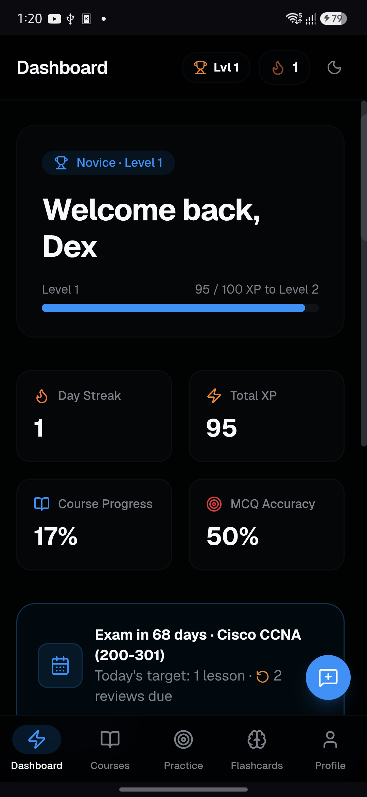

<div align="center">


# LazyPrep

### The Preparation OS

**Stop collecting study material. Start retaining it.**

LazyPrep turns certification prep into a system — structured courses, spaced
repetition, and mock exams that adapt to what you keep forgetting.

[](https://lazyprep.iamdex.codes)
[](LICENSE)
[](content/LICENSE)
[](https://nextjs.org)

**[Try it live](https://lazyprep.iamdex.codes)** · Android app coming to Google Play

<sub>A product by **[DexForge](https://dexforge.iamdex.codes)**</sub>

</div>

---

## The problem

Most people preparing for a certification do the same thing: hoard PDFs, watch
video courses at 2×, and highlight a textbook until it glows. Then they sit the
exam and discover that recognizing an answer is not the same as recalling it.

The bottleneck was never access to material. It's **retention over time**, and
knowing which topics are quietly decaying while you feel productive elsewhere.

LazyPrep is built around that single problem.

## How it works

**Structured courses, not a content dump.** Modules, lessons, and checkpoint
quizzes in a deliberate order, so there's always an obvious next action instead
of a syllabus to triage.

**Spaced repetition that schedules itself.** Flashcards and practice questions
run on the [SM-2 algorithm](https://en.wikipedia.org/wiki/SuperMemo) — the same
family Anki uses. Cards you find easy drift weeks out; cards you fumble come
back tomorrow. You never decide what to review.

**Mock exams with a mistake notebook.** Full timed attempts, scored and
reviewable. Every question you miss is collected into a notebook and folded back
into your review queue, so weak areas get more airtime automatically.

**Progress that reflects reality.** XP, levels, and streaks track *reviews
completed*, not hours logged. An exam countdown converts a distant date into a
concrete daily target.

**Bring your own AI.** Generate a custom course for any subject using your own
AI provider key. Your key is encrypted with AES-256-GCM before it touches the
database and is never returned to any client after saving.

**Installable, and offline-tolerant.** A PWA on desktop and iOS, and a native
Android app via Trusted Web Activity — full-screen, no browser chrome.

<div align="center">

<br />
<sub>The Android app — a Trusted Web Activity wrapping the live PWA</sub>
</div>

## Built with

| Layer | Choice |
| --- | --- |
| Framework | Next.js 16 (App Router, RSC, Server Actions) |
| Language | TypeScript 5 |
| UI | React 19, Tailwind CSS 4, Base UI, Framer Motion |
| Database | PostgreSQL (Neon) via Prisma 7 |
| Auth | Better Auth — email/password + Google OAuth |
| Email | Resend |
| Monitoring | Sentry |
| Validation | Zod 4 |
| Android | Bubblewrap TWA, `targetSdk` 36 |

## Self-hosting

You'll need Node.js 20+, pnpm, and a PostgreSQL database
([Neon](https://neon.tech) has a usable free tier).

```bash
git clone https://github.com/dexisworking/LazyPrep.git
cd LazyPrep
pnpm install

cp .env.example .env      # then fill in the values
```

At minimum set `DATABASE_URL`, `DIRECT_URL`, `BETTER_AUTH_SECRET`, and
`ENCRYPTION_KEY`. Generate the two secrets with:

```bash
openssl rand -base64 32
```

Google OAuth, Resend, and Sentry are all optional — leave them blank and those
features disable themselves cleanly.

```bash
pnpm prisma migrate deploy   # create the schema
pnpm content:import          # load the bundled CCNA course
pnpm dev                     # http://localhost:3000
```

### Adding your own course

Content lives in `content/` as plain Markdown and JSON — no code changes
required. Create a folder, add `course.json`, drop lessons in `lessons/*.md`,
and re-run the importer. See [`content/README.md`](content/README.md) for the
schema.

## Licensing

This repository is deliberately **split-licensed**:

| What | License | Means |
| --- | --- | --- |
| Application code | [MIT](LICENSE) | Fork it, self-host it, build on it |
| Course content in `content/` | [CC BY-NC-ND 4.0](content/LICENSE) | Read and learn — no commercial use, no redistributing modified versions |
| "LazyPrep", "DexForge", logos | Trademarks | Not licensed — forks must use their own branding |

Put plainly: **the engine is yours to use, the curriculum isn't.** The 51
lessons and flashcard decks under `content/` represent the bulk of the work
here, and they stay under DexForge copyright. Everything else is MIT.

## Contributing

Issues and pull requests are welcome — see
[CONTRIBUTING.md](CONTRIBUTING.md). Security issues should follow
[SECURITY.md](SECURITY.md) rather than a public issue.

## Legal

[Privacy Policy](https://lazyprep.iamdex.codes/privacy) ·
[Terms of Service](https://lazyprep.iamdex.codes/terms)

Certification and exam names referenced in the course content (including Cisco
CCNA) are trademarks of their respective owners. LazyPrep is an independent
study aid and is not affiliated with, endorsed by, or certified by any of those
organizations.

---

<div align="center">

**Crafted at [DexForge](https://dexforge.iamdex.codes)**

<sub>© 2026 DexForge · <a href="mailto:hello@iamdex.codes">hello@iamdex.codes</a></sub>

</div>
